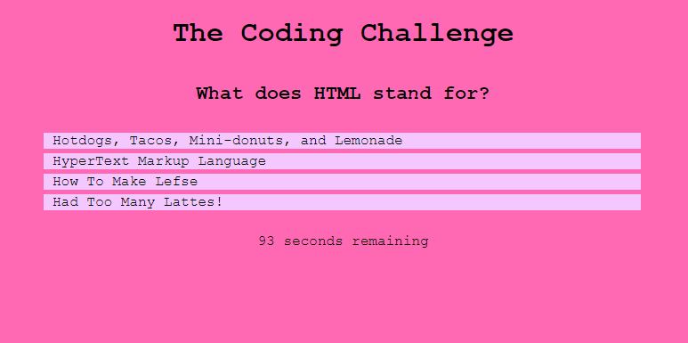

# Coding Challenge

## Find this project at: 

https://github.com/LindseyM20/coding-challenge

https://lindseym20.github.io/coding-challenge/

## Description:

Here you will find files for a dynamic application that will run in the browser to play a quiz game. The program utilizes DOM manipulation to create, set attributes for, and append elements to the page. A local storage feature will let the user save their scores and access them at any time. HTML, CSS, and JavaScript come together in this program, creating a clean and intuitive user experience.

## Installation:

N/A

## Usage Instructions:

To use this program, use your browser to go to https://lindseym20.github.io/coding-challenge/

Click on "START", click your answers, and follow the prompts to save your score.

## Credits:

Thank you to my great support system of peers, TAs, tutor, and instructors through the U of M Coding Bootcamp!

## License:

N/A
